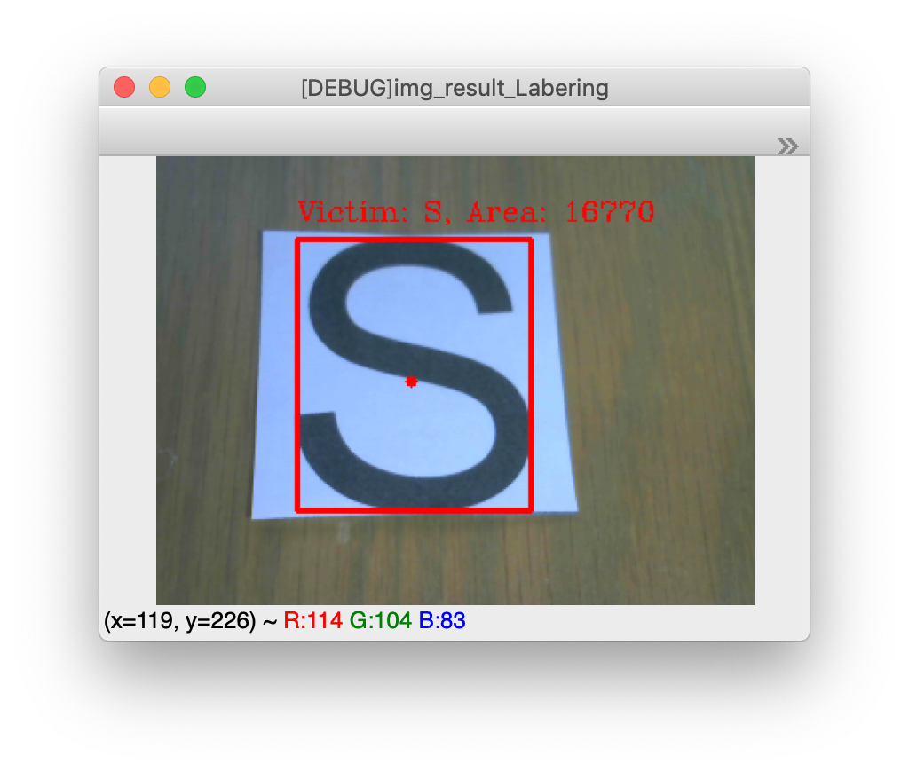
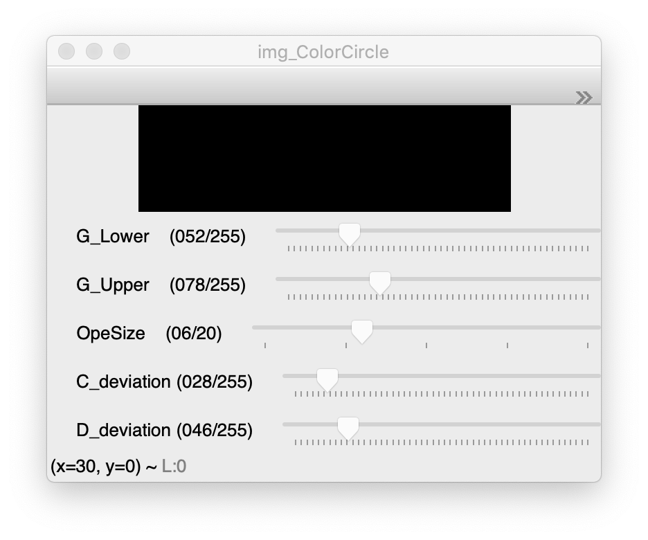
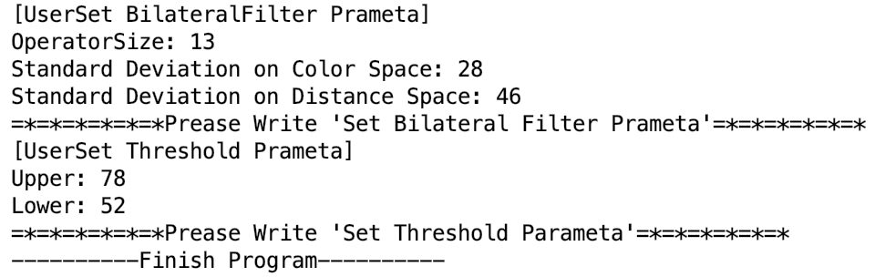

# Name

VisualVictimDetector_v1<br>
視覚的被災者検知システム_v1

<div align = "center">

</div>


# Overview
RoboCupJunior2017以降,RescueMazeでは熱源の被災者に加えて,視覚的被災者(VisualVictim)を検知しなければならないルールが追加された.視覚的被災者(以降VVとする)を検知する方法はいろいろあるが,本プログラムはwebカメラを用いて検知を行うものである. <br>


# Dependency

## Language
* Python 3.7 

## Library(Python Module)
* OpenCV3.4.0 <br>
    <dd> 画像を処理するために使用 </dd>
    
* time
    <dd> プログラムの動作速度を計測するために使用. <br> デバッガとしても使っtた.</dd>

* numpy
    <dd> OpenCVでは画像は2次元配列として扱うため使用.使った記憶はないがおまじない.

# Setup

## Enviroment
* PC <br>
    <dd> MacBook Pro (Retina, 13-inch, Early 2015), mojave(10.14.2) </dd>

* WebCamera <br>
    <dd> Logicool C270 </dd>

* IDE <br>
    <dd> PyCharm 2018.3.2 (Community Edition) </dd>

# Usage

IDE(Pycharm)とPython3.7はすでにPCに入っているとする.

1. C270とPCを接続する.
2. 以降は動作目的に応じて変更してほしい.<br>

## カメラ番号設定
"x"には任意の数値を指定.PCが起動して認識した順番に番号が振り分けられる.
PC内蔵webカメラと外部webカメラだと,だいたい0 or 1.

> cap = cv2.VideoCapture(x)

## Debug & Parameta Adjusting
本プログラムには,競技で使用できるプログラムとパラメータを調整するためのデバッグ機能を搭載している.この動作の切替はコメントアウトの位置を変えることにより切り替えができる.
下記の状態はデバッグモードである.

```python
## Debug Switch
FLAG_DEBUG = 'ON'
# FLAG_DEBUG = 'OFF' #Competition Mode
```
パラメータ調整を行うためのスイッチ.
下記は,パラメータ調整を行うためのツールを表示させる.

```python
# Debug Monitor
FLAG_DEBUG_MONITOR = 'ON'
# FLAG_DEBUG_MONITOR = 'OFF'
```
## Detect Area Range Parameta
オブジェクトの検出範囲を設定するパラメータ.
最小値が小さすぎるとスパイクノイズを検知しやすくなり,大きすぎると検知しにくくなる.

```python
## Detect Area Range
# 0: Min
# 1: Max
AREA_RANGE = [2000, 17000]
```

## Setting Parameta

プログラムのデバッグ機能を下記のように設定するとFig. 1のような画面が出てくる.
```python
## Debug Switch
FLAG_DEBUG = 'ON'
# FLAG_DEBUG = 'OFF' #Competition Mode

# Debug Monitor
FLAG_DEBUG_MONITOR = 'ON'
# FLAG_DEBUG_MONITOR = 'OFF'
```

<div align = "center">


**Fig. 1: Setting Parameta Window**

</div>

それぞれのトラックバーについて説明する.

### G_Lower : 
<dd> GrayScale画像において検知する輝度値のしきい値の**下限**を決めるパラメータ </dd>

### G_Upper : 
<dd> GrayScale画像において検知する輝度値のしきい値の**上限**を決めるパラメータ </dd>

### OpeSize : 
<dd> Bilateral FilterのOperatorサイズを決めるパラメータ.大きすぎるとフィルターの効果は大きくなるが,計算量が増えるため処理が重くなる. </dd>

### C_deviation : 
<dd> 色空間における標準偏差を決めるパラメータ. </dd>

### D_deviation : 
<dd> 距離空間における標準偏差を決めるパラメータ. </dd>


## Set Parameta
パラメータの設定が終了すると,CUIに結果が表示される.
<div align = "center">


**Fig. 2: Result Parameta**

</div>

この結果をソースコードに直接打ち込んで,デバッガーを解除すると競技用プログラムで設定したパラメータを使うことができる.


# Licence
This software is released under the MIT License, see LICENSE.

# Author
[GitHub]https://github.com/Tossy0423

# Created day
2018/12/23

# References

How to write README.md <br>
[online]https://karaage.hatenadiary.jp/entry/2018/01/19/073000

The MIT License <br>
[online]https://opensource.org/licenses/MIT

